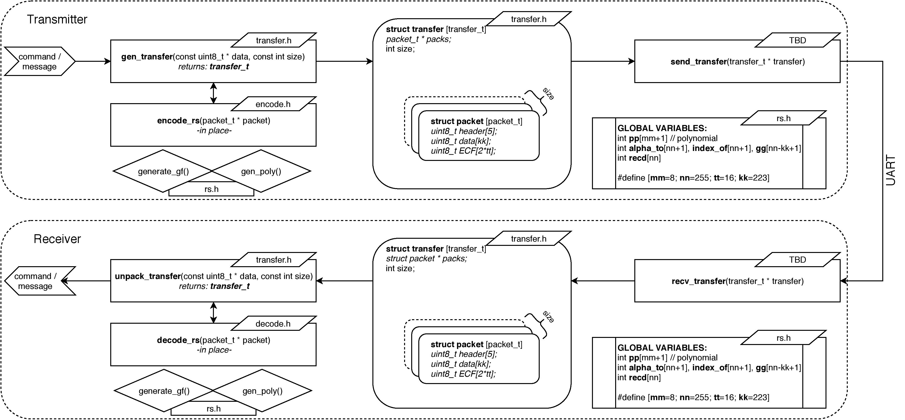

# Reed-Solomon Error Correcting Code

Included is a small project which is a software implementation of Reed-Solomon error correction. This project integrates existing Reed-Solomon code written by Simon Rockliff (University of Adelaide), and was part of an MSc Aerospace Engineering course.

---

## Software overview:

